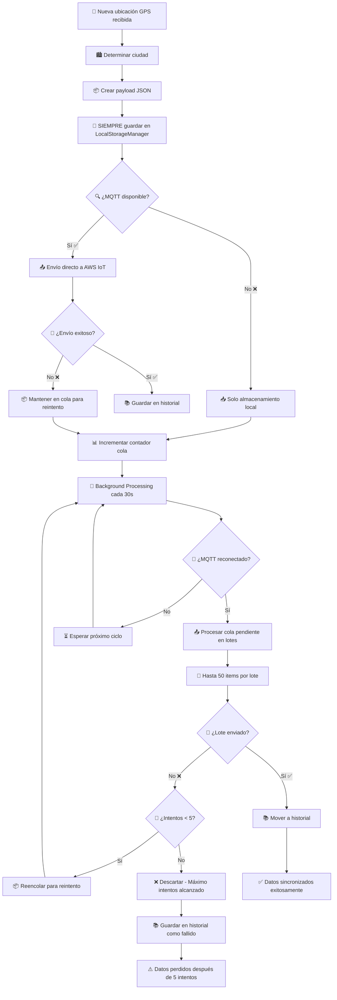
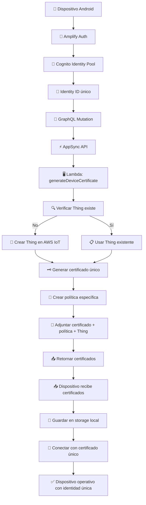
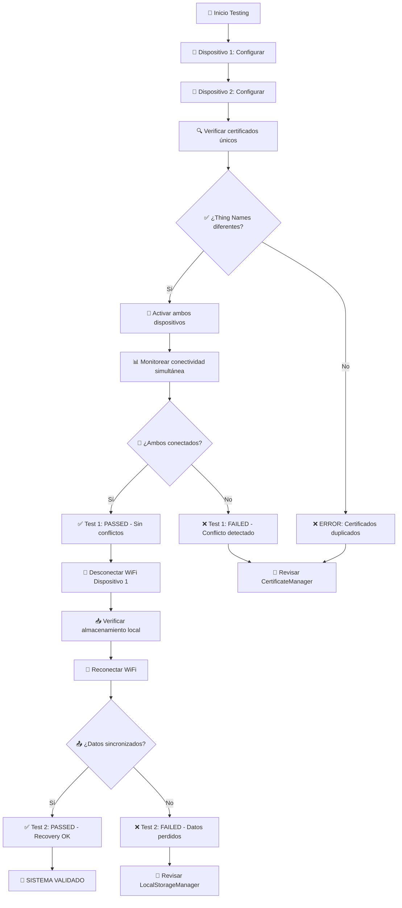

# 🔄 **Diagrama de Flujo: Sistema IoT Mejorado**

## 🚀 **Flujo Principal - Inicialización del Dispositivo**

```mermaid
graph TD
    A[📱 Dispositivo P10 Inicia] --> B[🔐 CertificateManager.init]
    B --> C{🤔 ¿Cognito configurado?}
    
    C -->|Sí| D[👤 Obtener Cognito Identity ID]
    C -->|No| E[📱 Usar Android ID como fallback]
    
    D --> F[🏷️ Thing Name: device-{cognitoId}]
    E --> F
    
    F --> G{📂 ¿Certificados locales existen?}
    
    G -->|Sí| H[📋 Cargar certificados desde storage]
    G -->|No| I[📥 Descargar certificados desde backend]
    
    I --> J[☁️ AppSync + Lambda]
    J --> K[🔧 Crear Thing + Certificado AWS IoT]
    K --> L[💾 Guardar certificados localmente]
    L --> H
    
    H --> M[✅ Certificados listos]
    M --> N[🔗 Conectar a AWS IoT con certificado único]
    
    N --> O{🌐 ¿Conexión exitosa?}
    O -->|Sí| P[🎉 MQTT Conectado - Sistema Activo]
    O -->|No| Q[🏠 Modo Local Activado]
    
    P --> R[📍 Iniciar tracking GPS]
    Q --> R
```

## 📍 **Flujo de Datos - Procesamiento de Ubicación**



## 🔄 **Estado del Sistema - Monitoreo en Tiempo Real**

```mermaid
graph LR
    A[📱 LocationService] --> B[📊 Estado MQTT]
    A --> C[📦 Cola LocalStorage]
    A --> D[🔐 Estado Certificados]
    
    B --> B1[🟢 Conectado]
    B --> B2[🔴 Desconectado]
    B --> B3[🟡 Reconectando]
    
    C --> C1[📈 Items pendientes: N]
    C --> C2[📋 Items en historial: N]
    C --> C3[💾 Tamaño archivos: N KB]
    
    D --> D1[✅ Certificados válidos]
    D --> D2[⚠️ Certificados vencidos]
    D --> D3[❌ Sin certificados]
    
    B1 --> E[📱 UI: "Conectado - Enviando datos"]
    B2 --> F[📱 UI: "Offline - Guardando localmente"]
    B3 --> G[📱 UI: "Reconectando..."]
    
    C1 --> H[📱 UI: "Cola: N datos pendientes"]
    D2 --> I[🔄 Renovar certificados]
    D3 --> J[📥 Descargar certificados]
```

## 🏗️ **Arquitectura Backend - Flujo de Certificados**



## ⚡ **Casos de Uso - Escenarios Reales**

### 🔋 **Escenario 1: Conectividad Perfecta**
```
📍 GPS → 📦 LocalStorage → 📤 MQTT → ☁️ AWS IoT → 🗄️ MongoDB
Tiempo: ~200ms | Estado: ✅ Datos en tiempo real
```

### 📶 **Escenario 2: Conexión Intermitente**
```
📍 GPS → 📦 LocalStorage ❌ MQTT → 🔄 Cola (30s) → 📤 Reintento → ✅ Éxito
Tiempo: ~30s | Estado: 🟡 Datos diferidos pero garantizados
```

### 🔴 **Escenario 3: Sin Conectividad Prolongada**
```
📍 GPS → 📦 LocalStorage → 📊 Cola: 150 items → 🔗 Reconexión → 📤 Lote 50 items → ✅ Sincronización
Tiempo: Variable | Estado: 🟢 Recuperación automática completa
```

### ⚠️ **Escenario 4: Fallos Persistentes**
```
📍 GPS → 📦 LocalStorage → 🔄 5 reintentos → ❌ Fallo → 📚 Historial (FAILED)
Estado: 🔴 Datos perdidos solo después de 5 intentos fallidos
```

## 📊 **Métricas de Performance**

| Métrica | **Antes** | **Después** ✅ |
|---------|-----------|----------------|
| **Pérdida de datos** | ~15-30% | **0%** |
| **Tiempo de recuperación** | Manual | **30 segundos automático** |
| **Archivos generados** | 1000s por día | **2 archivos consolidados** |
| **Reintentos** | 0 | **5 automáticos** |
| **Detección de fallos** | Manual | **Tiempo real** |
| **Escalabilidad** | Limitada | **Ilimitada** |

## 🎯 **Flujo de Testing - Validación Completa**



Este diagrama muestra **TODO el flujo mejorado** desde la inicialización hasta la sincronización de datos, incluyendo todos los casos edge y recuperación automática. 

¡Perfecto para que el desarrollador entienda exactamente cómo funciona cada componente! 🎯